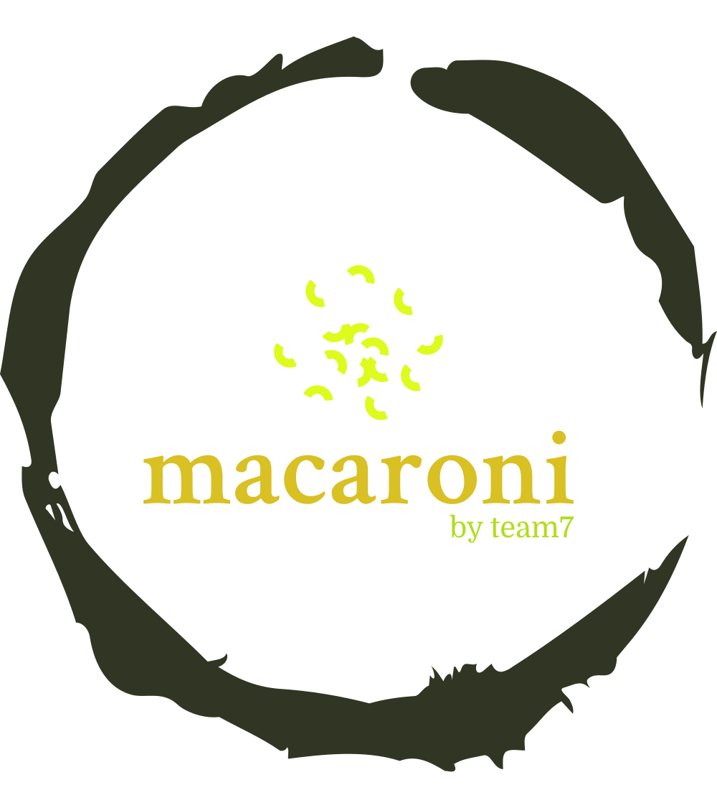

<p>
  
</p>

Welcome to Macaroni, a simple programming language that supports basic functions such as variable declaration, assignment, various expressions, ternary expression, conditional statements, while loop and for loops. Macaroni is implemented using ANTLR4 to generate parse tree and interpreter using the visitor pattern.

Macaroni language is designed to be easy to learn and use, while providing essential programming concepts for building basic algorithms. It is an ideal choice for those who are new to programming or need a lightweight language for simple scripting tasks.

Our interpreter is efficient and optimized to handle various types of expressions and loops. It is a great tool for developers who need to quickly test out their ideas without worrying about complex syntax or setup.


## Tech Stack

**Programming Language:** Java

**Build:** JDK17

**Tools:** ANTLR4


## Instructions To Run

Macaroni is supported on Windows 10/11 and MacOS Ventura

```bash
  java -jar macaroniC.jar samples/prog.mc
```


## Authors

- [Raumil Bharatbhai Dhandhukia](https://www.github.com/raumildhandhukia)
- [@parvd](https://www.github.com/octokatherine)
- [@chaityas](https://www.github.com/octokatherine)
- [Austin Kwon](https://github.com/akwon20)
- [Dhairya Dudhatra](https://github.com/Dhairya-Dudhatra)

## Youtube Demonstration
[https://www.youtube.com/watch?v=xC8dUAKgLGw](https://www.youtube.com/watch?v=xC8dUAKgLGw)

